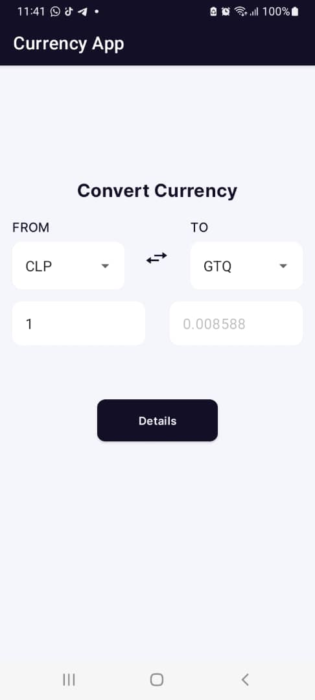
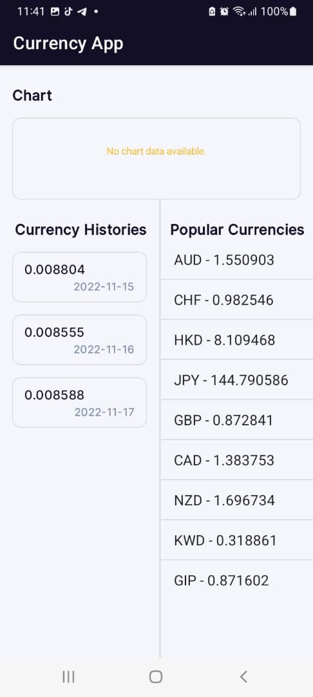

# Currency App

Hey there 👋🏼👋🏼👋🏼 !
Currency App is a simple android application developed to demonstrate clean architectural guidelines with MVVM android architecture.

_Note: Currency App data source is from star wars api and not cache implement.
See API Documentation [Here]("https://fixer.io/documentation")_
Go to the site to get a free api_key

## Feature
* Clean Architecture With MVVM
* Kotlin Coroutine with flow for async operations
* Dagger Hilt for dependency injection
* Room Database for data persistence
* View Binding to bind UI layout to data model
* Retrofit library to had interaction with external api
* Mockito for Unit testing
* Roboelectric for Integration testing


## Get Started
**As this is an android project, you will need an android device to run the application**
_Instruction to run the project_
* Download and install lastest android studio on your device.
    - [Here](https://developer.android.com/studio) is the link to download the lastest version of android studio
* Clone the project repository by running the following command line on a terminal

    ```
    https://github.com/Ayodeji97/Currency
    ```
* Open project in android studio by clicking of File -> New -> Import project and choose the downloaded project
* Run the app

## Libraries
* [Kotlin Coroutine](https://developer.android.com/kotlin/coroutines)
* [Kotlin Flow](https://developer.android.com/kotlin/flow)
* [Retrofit 2](https://github.com/square/retrofit)
* [ViewBinding](https://developer.android.com/topic/libraries/view-binding)
* [ViewModel](https://developer.android.com/topic/libraries/architecture/viewmodel)
* [Gson](https://github.com/google/gson)
* [Androidx](https://developer.android.com/jetpack/androidx)
* [Navigation componenet](https://developer.android.com/guide/navigation)
* [Dagger Hilt](https://dagger.dev/hilt/)
* [Timber](https://github.com/JakeWharton/timber)
* [OkHttp3](https://square.github.io/okhttp/)
* [Navigation Componenet](https://developer.android.com/guide/navigation)
* [Truth](https://truth.dev/) - Assertions Library,provides readability as far as assertions are concerned
* [MockWebServer](https://github.com/square/okhttp/tree/master/mockwebserver) - web server for testing HTTP clients ,verify requests and responses on the star wars api with the retrofit client.
* [Robolectric](http://robolectric.org/) - Unit test on android framework.
* [Espresso](https://developer.android.com/training/testing/espresso) - Test framework to write UI Tests


# Screen Shots
<p float="left">
  
  
</p>
